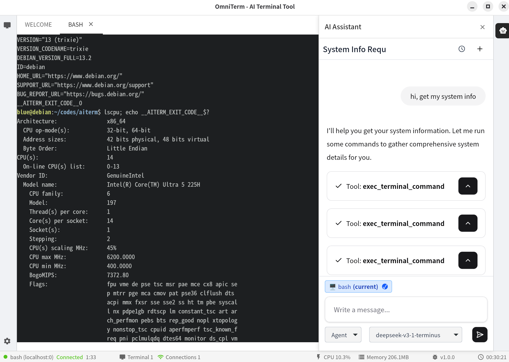

# OmnitTerm

A multi-asset terminal & AI assistance tool based on Wails3 + Go + React (MUI + Xterm). It provides unified asset (hosts/local) management, WebSocket terminal sessions, multi-model AI Chat, and a headless pure backend mode.



Themes in `src/themes.ts`. Terminal component `components/assets/Terminal.tsx` sets dark background and auto-resize events based on theme.

## Contributing
See CONTRIBUTING.md for code style & submission process. Issues/PRs welcome.

## Security
See SECURITY.md to report vulnerabilities. Sensitive terminal data is not persisted; only in-memory session data.

## Roadmap (Summary)
- [ ] Dynamic port & env var OMNITERM_PORT
- [ ] Multi protocol terminal (RDP/VNC/Database)
- [ ] Asset config validation & encrypt sensitive fields
- [ ] Pluggable AI tool invocation

## Features
- Terminal management: WebSocket `/terminal/connect/:assetId`, resize, pause/resume output stream
- Asset management: REST CRUD + SSH config import & parse
- AI Assistant: multi-provider (ark, deepseek, claude, gemini, ollama, openai, qianfan, qwen) chat & auto title
- Two run modes: GUI (Wails) and `headless` pure API/static
- Light/dark themes; terminal forced dark background
- Embedded static frontend (dist) with SPA fallback & ETag caching

## Directory Structure (Key)
```
backend
  main.go / main_headless.go / router.go
  pkg/
    service/terminal_service.go  # terminal core logic
    message/term.go              # WebSocket protocol
    models/asset.go, model.go    # data & config
frontend/
  src/App.tsx, components/assets/Terminal.tsx
  src/themes.ts                  # theme customization
```

## Environment Variables
| Variable                | Purpose | Default |
|-------------------------|---------|---------|
| OMNITERM_DISABLE_STATIC | Disable embedded static when `1` | enabled |
| (future) OMNITERM_PORT  | Override API port | 8088 |

## Run Modes
### GUI
```bash
go build -o bin/omniterm .
./bin/omniterm
```
### Headless (headless)
```bash
go build -tags headless -o bin/omniterm-headless .
./bin/omniterm-headless
```
Disable static (optional):
```bash
OMNITERM_DISABLE_STATIC=1 go build -tags headless -o bin/omniterm-headless .
```

## Build Modes
- GUI + API: `go build -o bin/omniterm .`
- Headless API (+ optional static): `go build -tags headless -o bin/omniterm-headless .`
Explanation:
- GUI build tag: `//go:build !headless`
- Headless build tag: `//go:build headless`
- Disable static: `OMNITERM_DISABLE_STATIC=1`
- Static port override: `OMNITERM_HTTP_PORT` (default 8080)
- Standalone server: `go build -o omniterm-headless -tags headless .`

## Quick Smoke Test
```bash
# GUI
go build -o bin/omniterm . && ./bin/omniterm &
# Headless
go build -tags headless -o bin/omniterm-headless . && ./bin/omniterm-headless &
# Ports
lsof -i:8088 -i:8080
```

## API Summary
- Terminal: GET /terminal/connect/:assetId (WebSocket)
- Assets: /api/assets CRUD; import SSH POST /api/assets/import/ssh; parse SSH GET /api/assets/ssh-config
- Models: /api/models CRUD; test POST /api/models/test
- Conversations: /api/conversations list/create/update title/delete/messages
- Chat: POST /api/chat

## WebSocket Protocol (term.go)
| Type | Fields | Description |
|------|--------|-------------|
| TermSetSessionId | session_id | Set session ID |
| TermResize | rows, cols | Resize terminal |
| TermInput | data | User input |
| TermPause | pause(bool) | Pause/resume output |
| TermOutputRequest | request_id, lines | Request recent output |
| TermOutputResponse | request_id, output[], success, error | Output response |

## Build & Packaging
- Wails3 GUI build: `wails3 build`
- Taskfile multi-platform packaging (AppImage / NFPM / Windows NSIS / MSIX)

## Frontend Dev
```bash
go build -o bin/omniterm . && ./bin/omniterm &
# omniterm
go build -tags headless -o bin/omniterm-headless . && ./bin/omniterm-headless &
```

Enjoy building with Wails3.
